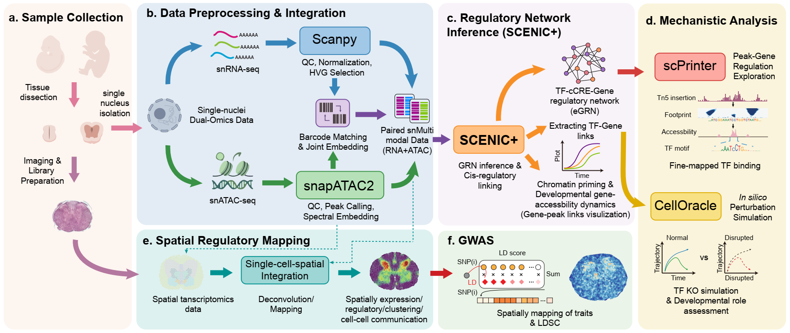

# Human Spinal Cord Multi-omics Atlas

## Overview

This repository collects the analysis code we used to study the developing human spinal cord with **single-nucleus Multiome (snRNA + snATAC)** and **Stereo-seq** spatial transcriptomics. The directory layout follows our end-to-end workflow—from raw quantification and modality-specific processing to spatial integration, pathway scoring, regulatory inference, niches, cell–cell communication, and trait enrichment.



## Repository structure

```text
Project_Code_Release/
├── snMultiomic/
│   ├── README.md
│   ├── 01_preprocessing_cellranger/
│   ├── 02_snrna_scanpy/
│   ├── 03_snatac_snapatac2/
│   ├── 04_motif_homer/
│   ├── 05_rna_velocity_scvelo/
│   ├── 06_footprint_scprinter_seq2print/
│   ├── 07_grn_scenicplus_pycistopic/
│   └── 08_celloracle_perturbation/
├── spatial/
│   ├── README.md
│   ├── 01_stereo_preprocessing/
│   ├── 02_integration_seurat_harmony_knn/
│   ├── 03_cell2location_visualization/
│   ├── 04_spatial_pathway/
│   ├── 05_spatial_multimapping_atac_magic_chromvar/
│   ├── 06_nichecompass_niches/
│   ├── 07_neighborhood_ncem_cellchat/
│   └── 08_trait_gwas_gsmap_ldsc/
├── method.md
├── .gitignore
├── LICENSE
└── README.md
```

**Submodule docs:** `snMultiomic/README.md` and `spatial/README.md` summarize the recommended order, outputs, and notes; each numbered folder under them has its own `README.md` where applicable.

## Workflow

1. **snMultiomic:** Quantify Multiome data (Cell Ranger ARC); analyze snRNA (Scanpy) and snATAC (SnapATAC2) with label transfer; motif enrichment (HOMER); optional RNA velocity (velocyto + scVelo); footprinting (scPrinter / Seq2Print); gene regulatory networks (pyCistopic, SCENIC+); in silico TF perturbation (CellOracle).
2. **spatial:** Preprocess Stereo-seq; integrate with single-nucleus references (Seurat / Harmony / kNN); Cell2location deconvolution; spatial pathway scores (UCell); pseudo spatial-ATAC and chromVAR; NicheCompass niches; neighborhood / NCEM / CellChat; trait mapping and LDSC-style enrichment.

## Path conventions

Notebooks were developed on an internal cluster and may still reference paths such as `/cluster2/huanglab/...`. Define a **single project root** (or config) at the top of each script or notebook and build all paths from it before reuse or publication.

## Citation
...
